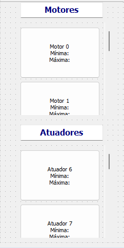
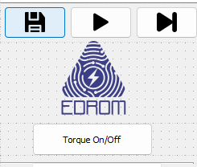
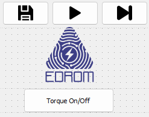

## Software de Pages
1- o que é o Software Pages?
    O software Pages desempenha um papel fundamental no desenvolvimento dos movimentos da robô. É por meio deste software que são determinados
    não apenas os principais movimentos da robô, mas também o controle preciso de seus motores e atuadores. Com sua interface intuitiva e poderosas ferramentas de programação, o Pages possibilita a criação de sequências de movimentos complexos e coordenados, essenciais para o desempenho eficiente da robô em uma variedade de tarefas e ambientes, como no caso da EDROM, o ambiente de competições.

2- Instalação do Software
    Utilizamos o PyQt, uma biblioteca Python que simplifica a criação de interfaces gráficas de usuário (GUI). Esta ferramenta é altamente versátil, pois pode ser empregada em uma variedade de sistemas operacionais, incluindo Windows, Linux e macOS. O PyQt oferece uma vasta gama de widgets e ferramentas de interface, o que agiliza significativamente o processo de desenvolvimento, permitindo a criação de interfaces visualmente atraentes e intuitivas.

    Durante o desenvolvimento da interface, empregamos o Qt Designer, uma aplicação que facilita a criação visual de interfaces gráficas. O Qt Designer pode ser facilmente instalado no Windows e no macOS através do seguinte link: https://build-system.fman.io/qt-designer-download.

    Por outro lado, outra opção é instalar o próprio PyQt, o que pode ser feito de várias maneiras. Para obter informações detalhadas sobre as diferentes abordagens de instalação do PyQt, recomendamos consultar o seguinte link: https://pythonbasics.org/install-pyqt/.

3 - Apresentação do design da página principal
    No programa, era essencial realizar a modelagem rápida de todos os motores e atuadores que seriam utilizados. Para atender a essa necessidade, optamos por utilizar duas áreas de rolagem (scroll areas), uma destinada a cada tipo de motor.
    

    Cada motor/atuador é representado por um botão (push button), que ao ser acionado, direciona para uma área de controle por sliders (a ser atualizada posteriormente). Na interface principal, serão exibidos os valores máximos e mínimos que os motores podem alcançar.

    No canto superior esquerdo, há um botão denominado Torque on/off. Quando o torque está desativado (off), os motores não podem ser movimentados. Quando ativado (on), permite a definição de posições, facilitando a criação dos movimentos do robô.
    

    Logo acima da logo, encontramos três botões essenciais para a operação do sistema. O primeiro é o botão de "Salvar Movimento", que permite armazenar a configuração atual dos motores e atuadores. O segundo é o botão "Realizar Ação", que executa os movimentos programados no robô. O terceiro é o botão "Próximo", que avança para a próxima etapa ou configuração, facilitando a sequência de ajustes e verificações necessárias para completar a programação dos movimentos do robô. 
    
    O resultado da página principal foi esse:

4- Contrução e componentes da página principal
    1 - Scroll Area
        Importante ativar a ScrollBar on para poder fazer a movimentação.
        Colocar os push bottons na scroll área, nos próprios botãos é possível escrever um texto.
        Para organização, colocamos uma label indicando qual são os Motores e quais são os atuadores

    

